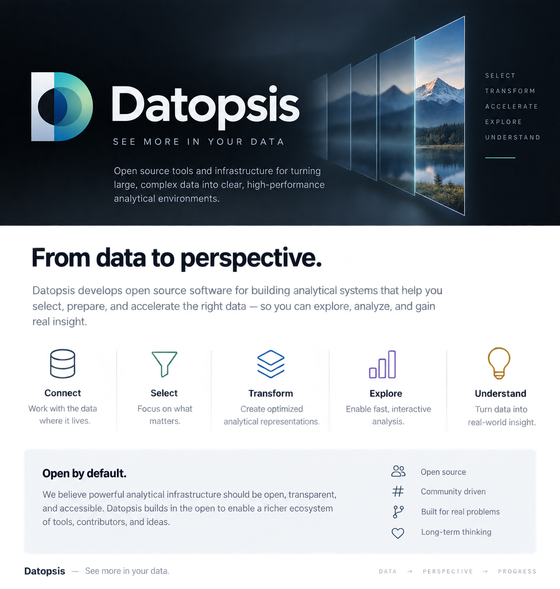

<p align="center">
  
</p>

# Datopsis

**Datopsis builds open-source systems for turning large, complex datasets into fast, understandable, and useful analytical environments.**

We are interested in the infrastructure between durable information and human understanding: storage formats, catalogs, query engines, analytical databases, high-performance systems software, visualization backends, and the orchestration required to make them work together reliably.

Our projects favor **open standards, composable architecture, reproducible engineering, and performance that can be measured rather than assumed**.

## What we work on

- **Analytical infrastructure** — systems that make large datasets practical for interactive exploration and visualization.
- **High-performance systems software** — especially Rust-based components for ingestion, transformation, networking, concurrency, and binary processing.
- **Open table and storage ecosystems** — interoperable architectures built around technologies such as Apache Iceberg, Parquet, Arrow, object storage, and REST catalogs.
- **Query and serving systems** — connecting durable storage to engines optimized for low-latency analytical workloads.
- **Observability and reproducibility** — lineage, benchmarking, provenance, operational transparency, and repeatable deployments.
- **Applied research** — exploring better ways to organize, move, transform, query, and understand complex information.

## Current work

Our initial work is focused on an analytical workspace architecture that keeps an open table format as the authoritative source while creating optimized, disposable OLAP representations for interactive analysis.

```text
Authoritative storage
        │
        ▼
Open table metadata + object storage
        │
        ▼
Dataset selection and orchestration
        │
        ▼
Optimized analytical workspace
        │
        ▼
Interactive exploration and visualization
```

The goal is simple: **retain open, durable source-of-truth storage while giving users the performance of a purpose-built analytical system when they need it.**

## Engineering principles

**Open by default.** Prefer open protocols, formats, interfaces, and implementations where practical.

**Separate truth from acceleration.** Durable source data should not be coupled to a particular query engine or visualization system.

**Move computation to the data path.** Large datasets should flow directly between storage and analytical engines instead of through control-plane services unnecessarily.

**Optimize for real workloads.** Physical layouts, indexes, rollups, and caching strategies should follow observed query behavior and measurable performance requirements.

**Make lineage explicit.** An analytical result should be traceable to the exact source, version, selection, and transformation that produced it.

**Build composable systems.** Individual components should be useful independently and replaceable as technologies evolve.

---

<p align="center">
  <strong>Datopsis</strong><br />
  <sub>From information to perspective.</sub>
</p>
